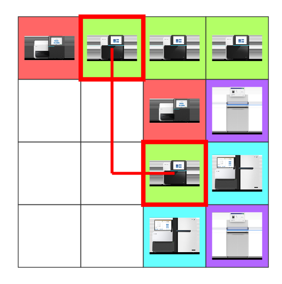

# 连连看R语言版

灵感来自“菜鸟学Python”公众号文章《[太好玩了，我用Python写了个火影忍者版的连连看](https://mp.weixin.qq.com/s/MYm3UXT-yHUxvdIFnBe0lA)》，采用R语言独立实现。

## 界面截图



## 环境依赖

需要以下R包（请使用install.packages命令提前进行安装）：

* tidyverse
* ggmap
* grid
* imager

## 使用方法

在R语言环境中运行：

```r
R> source("https://github.com/yanlinlin82/link-game-in-r/raw/master/link-game.R")
R> play(4, 4)
```

## 补充说明

注：本游戏使用的图片为当代高通量测序仪，下载自各设备厂商网站，版权归属原厂商所有。
